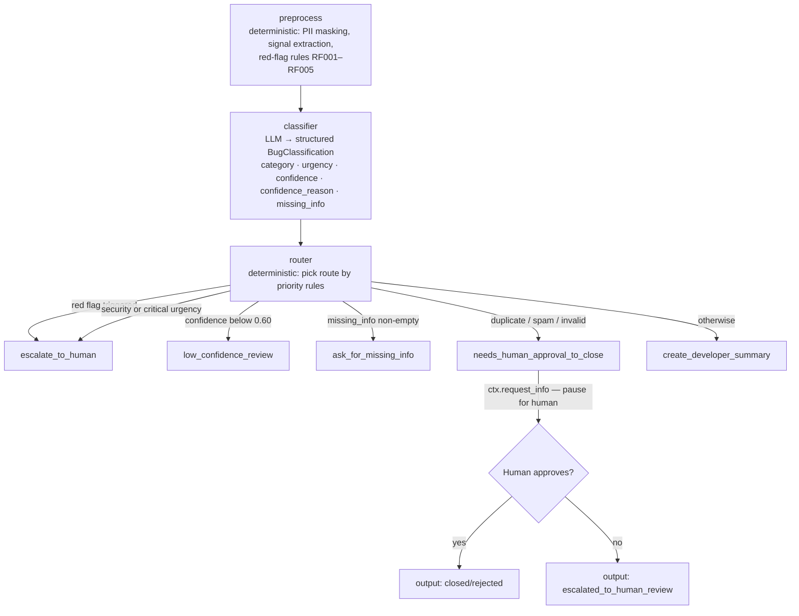

# Bug Report Triage Agent


An agentic workflow that triages incoming bug reports end-to-end: it preprocesses the raw text, classifies it with an LLM into a structured schema, applies deterministic override rules, and routes each report to the right action — all with a typed audit trail and a human-in-the-loop gate for risky decisions.

## Why this exists

Manual bug triage is slow and inconsistent: the same report gets different priority depending on who reads it first. This project automates the triage decision while keeping humans in the loop for the cases that matter — security escalations, ambiguous reports, and risky close/reject actions. It is also a reference implementation of how to compose LLM classification with deterministic safety rules so the LLM can never silently route a dangerous report to a low-priority action.

---

## Tech stack

| Layer | Technology |
|---|---|
| Workflow orchestration | [Microsoft Agent Framework](https://pypi.org/project/agent-framework-core/) 1.8.1 |
| LLM classification | OpenAI `gpt-4o-mini` via MAF structured output (`response_format=BugClassification`) |
| Data validation | [Pydantic](https://docs.pydantic.dev/) v2 |
| Linting | [ruff](https://docs.astral.sh/ruff/) |
| Runtime | Python 3.10+ |
| Packaging | `pyproject.toml` src-layout, `pip install -e ".[dev]"` |
| Testing | pytest (fully offline; no API key needed) |
| Containers | Docker + Docker Compose |

---

## Architecture



### Design principles

- **Classifier proposes, router decides.** The LLM suggests a route on `BugClassification.route`; the deterministic `decide_route()` function in `router.py` is the final authority and can override it.
- **Explicit confidence as a float.** `BugClassification.confidence` is a `float` between 0.0 and 1.0 (enforced by Pydantic). The router routes anything below 0.60 to `low_confidence_review` — ambiguous reports are caught directly rather than inferred from missing fields or approval failures.
- **Deterministic red-flag rules.** Five regex-based rules (RF001–RF005) fire during preprocessing. If any trigger, the router escalates regardless of what the LLM says.
- **Human-in-the-loop for risky actions.** Closing or rejecting a report (duplicate/spam/invalid) requires explicit human approval via MAF's `request_info` / `response_handler` API.
- **LLM isolation.** Only `classifier_agent.py` talks to OpenAI. Every other module is deterministic and unit-testable offline.

---

## Quick start

### Option A — Docker (recommended, zero setup)

```bash
git clone https://github.com/danielchani/bug-triage-agent-.git
cd bug-triage-agent-
cp .env.example .env          # add your OPENAI_API_KEY if you want real LLM mode

# One-command demo (offline mock mode — no API key needed):
docker compose run -e BUG_TRIAGE_MOCK_LLM=true bug-triage samples/complete_bug.txt

# Real LLM mode (requires OPENAI_API_KEY in .env):
docker compose run bug-triage samples/critical_security.txt

# Batch mode:
docker compose run -e BUG_TRIAGE_MOCK_LLM=true bug-triage --batch samples/
```

Or with plain `docker run`:

```bash
docker build -t bug-triage-agent .
docker run --rm -e BUG_TRIAGE_MOCK_LLM=true bug-triage-agent samples/complete_bug.txt
```

### Option B — Local Python

```bash
git clone https://github.com/danielchani/bug-triage-agent-.git
cd bug-triage-agent-

python -m venv .venv
# Windows
.venv\Scripts\activate
# macOS / Linux
source .venv/bin/activate

pip install -e ".[dev]"

cp .env.example .env
# edit .env — add OPENAI_API_KEY or leave BUG_TRIAGE_MOCK_LLM=true for offline use
```

---

## Environment variables

Set these in `.env` (see `.env.example`). `.env` is gitignored and must never be committed.

| Variable | Default | Purpose |
|---|---|---|
| `OPENAI_API_KEY` | _(empty)_ | Required in real mode. Missing key raises a clear `AuthenticationError` at classifier time. |
| `OPENAI_CHAT_MODEL_ID` | `gpt-4o-mini` | Model used for classification. |
| `BUG_TRIAGE_MOCK_LLM` | `false` | `true` → deterministic keyword-based classifier; no network or API key needed. |

---

## Running samples

```bash
# Escalates immediately (security keywords + RF004 red flag)
python -m bug_triage.main samples/critical_security.txt

# Asks for missing info (no version/OS/steps in the report)
python -m bug_triage.main samples/missing_info.txt

# Creates developer summary (complete, actionable report)
python -m bug_triage.main samples/complete_bug.txt

# Pauses for human approval before closing a duplicate
python -m bug_triage.main samples/invalid_needs_approval.txt --auto-approve
python -m bug_triage.main samples/invalid_needs_approval.txt --auto-reject
```

### Batch, stdin, and audit log

```bash
# All .txt files in a folder (continues if one file fails)
python -m bug_triage.main --batch samples/

# CSV with a "text" column (also accepts: body, description, report)
python -m bug_triage.main --csv samples/batch_sample.csv

# Read from stdin
echo "App crashes on startup, Windows 11 v2.3.1. Steps: open app." | python -m bug_triage.main --stdin

# Write JSONL audit log (parent directories created automatically)
python -m bug_triage.main samples/complete_bug.txt --audit-log outputs/audit.jsonl
python -m bug_triage.main --batch samples/ --audit-log outputs/audit.jsonl
```

---

## Sample output

Running `python -m bug_triage.main samples/complete_bug.txt`:

```
[executor_started] preprocess
[executor_completed] preprocess
[executor_started] classifier
[executor_completed] classifier
[executor_started] router
[executor_completed] router
[route] -> create_developer_summary
[route] requires_human=False risky_action=False
[route] Looks like a complete, actionable bug report.
[executor_started] create_developer_summary
[output] create_developer_summary:
DEVELOPER TICKET SUMMARY
Category: bug | Urgency: medium | Sentiment: calm
Version: 4.12.1
OS: Windows
Stack trace included: yes
Reasoning: Mock classifier: generic bug report; route guess based on whether key details are present.

Original report:
Export to CSV fails on rows with commas in the Notes field. ...
```

Full transcript including the human-approval flow: [`sample_run.txt`](sample_run.txt).

---

## Running tests

```bash
# All 134 tests — fully offline, no API key needed
pytest

# Verbose output
pytest -v

# Specific module
pytest tests/test_golden_evals.py -v

# Lint
ruff check .
```

The test suite covers:

- Pydantic model validation (invalid inputs, confidence bounds, new route)
- Deterministic preprocessing (email masking, version/OS/stack-trace extraction)
- Red-flag rules RF001–RF005 (21 hit cases, 5 benign cases, multi-rule triggering)
- Router priority rules: all 6 rules including confidence threshold, red-flag hard overrides, and priority conflicts
- Mock classifier: confidence float values, confidence_reason, all routing outcomes
- Audit log: field correctness, stable report_id hash, no PII leakage, parent dir creation
- Batch/stdin/CSV input including failure resilience
- 12 golden eval cases covering complete bugs, missing info, security, data leak, payment risk, duplicate, spam, vague, contradictory, priority conflict, production outage, API key leak
- End-to-end workflow: all 5 routes, human-approval approve and reject paths

---

## Routing rules

The router (`src/bug_triage/router.py`) picks exactly one route in priority order:

| Priority | Condition | Route | Human? | Risky? |
|---|---|---|---|---|
| 0 | `red_flags_triggered` non-empty | `escalate_to_human` | Yes | No |
| 1 | `category == "security"` or `urgency == "critical"` | `escalate_to_human` | Yes | No |
| 2 | `confidence < 0.60` | `low_confidence_review` | Yes | No |
| 3 | `missing_info` non-empty | `ask_for_missing_info` | No | No |
| 4 | `category` in `{duplicate, spam, invalid}` | `needs_human_approval_to_close` | Yes | Yes |
| 5 | otherwise | `create_developer_summary` | No | No |

### Red-flag rules (RF001–RF005)

Regex patterns run at preprocess time on sanitized text; override LLM output unconditionally.

| ID | Covers |
|---|---|
| RF001 | SQL injection, XSS, RCE, CSRF, API key / token leak |
| RF002 | Data breach, GDPR, PII exposure, wrong user data, data loss |
| RF003 | Service outage, production down, all users affected, cannot login |
| RF004 | Authentication bypass, privilege escalation, zero-day, account takeover |
| RF005 | Double charge, unauthorized charge, payment taken twice |

---

## Audit log

Pass `--audit-log <file>` to record every triage decision in JSONL format (one JSON object per line). Parent directories are created automatically.

```bash
python -m bug_triage.main samples/complete_bug.txt --audit-log outputs/audit.jsonl
```

Each entry records:

```json
{
  "timestamp": "2026-06-25T14:30:00+00:00",
  "report_id": "a3f9b2c1d4e5",
  "input_source": "samples/complete_bug.txt",
  "category": "bug",
  "urgency": "medium",
  "sentiment": "calm",
  "confidence": 0.9,
  "confidence_reason": "All required fields are present.",
  "proposed_route": "create_developer_summary",
  "final_route": "create_developer_summary",
  "router_reason": "Looks like a complete, actionable bug report.",
  "requires_human": false,
  "risky_action": false,
  "red_flags": [],
  "missing_info": [],
  "reasoning": "Mock classifier: generic bug report.",
  "human_decision": null,
  "action_status": "completed"
}
```

No raw PII is logged — email addresses are replaced with `[EMAIL]` by the preprocessing step before the audit entry is written.

---

## Project structure

```
bug-triage-agent-/
├── Dockerfile
├── docker-compose.yml
├── pyproject.toml            # package metadata + dependencies (src-layout)
├── requirements.txt
├── .env.example
├── sample_run.txt            # full captured transcript
├── evals/
│   └── golden_cases.jsonl    # 12 labeled hard cases for offline eval
├── samples/
│   ├── critical_security.txt
│   ├── missing_info.txt
│   ├── complete_bug.txt
│   ├── invalid_needs_approval.txt
│   └── batch_sample.csv
├── src/bug_triage/
│   ├── models.py             # BugClassification, RouteDecision, ... (Pydantic)
│   ├── red_flags.py          # deterministic RF001–RF005 override rules
│   ├── preprocess.py         # PII masking, signal extraction, red-flag evaluation
│   ├── classifier_agent.py   # LLM executor + offline mock
│   ├── router.py             # decide_route() — final routing authority
│   ├── actions.py            # 5 terminal executors incl. request_info gate
│   ├── audit_log.py          # JSONL decision audit log
│   ├── workflow.py           # MAF workflow graph assembly
│   └── main.py               # CLI: single file, --stdin, --batch, --csv, --audit-log
└── tests/                    # 134 tests, all offline
```

---

## Engineering decisions

| Decision | Rationale |
|---|---|
| **Classifier proposes, router decides** | Keeps the LLM out of safety-critical routing logic. `decide_route()` is a pure, fully-tested function — the LLM's `route` suggestion is a hint, not an instruction. |
| **`confidence` as a float (0.0–1.0) with a 0.60 threshold** | Gives the LLM a continuous signal to express partial uncertainty. The router uses a single threshold (`< 0.60`) to route ambiguous reports for human review rather than silently continuing to a low-priority automated action. |
| **Red-flag rules at preprocess time** | Regex patterns run before the LLM, so a dangerous keyword (SQL injection, double charge, production outage) can never be quietly routed to `create_developer_summary`. The `red_flags_triggered` field is on `PreprocessedBugReport` and checked first by the router. |
| **JSONL audit log (not a database)** | Zero dependencies, zero schema migration. A flat file is sufficient for a single-instance CLI tool and trivially importable into any analytics tool. |
| **Mock classifier with identical output type** | Both real and mock paths return the same `BugClassification` Pydantic model. The entire test suite runs offline with no mocking of the workflow itself — only the API call is replaced. |
| **MAF `request_info` for human approval** | Uses the framework's built-in pause/resume primitive instead of polling or callbacks. The workflow suspends at a well-defined point and resumes only when the human responds. |

---

## Quality gates

| Gate | What it covers | Count |
|---|---|---|
| Offline unit tests (pytest) | Models, preprocess, red-flag rules, router, mock classifier, audit log, batch/stdin/CSV | 134 tests |
| Router truth-table | All 6 routing rules including priority conflicts, confidence threshold edge cases | 15 parametrized cases |
| Red-flag parametrized tests | RF001–RF005: hit cases, benign cases, multi-rule triggering | 27 cases |
| Golden eval cases | 12 labeled hard cases: complete bug, missing info, security, data leak, payment risk, duplicate, spam, vague, contradictory, priority conflict, production outage, API key leak | 12 cases |
| End-to-end workflow tests | All 5 routes, human-approval approve + reject paths | 8 tests |
| CI (GitHub Actions) | ruff lint + full test suite on Python 3.10 and 3.12, every push / PR | `ci.yml` |

---

## Known limitations

- **No persistence layer** — the audit log is a flat file; no database or search index.
- **No web interface** — CLI only; no REST endpoint to submit reports over HTTP.
- **Single-tenant** — no user/org model; all reports go into one workflow instance.
- **No LLM retry logic** — if the OpenAI call times out, the run fails with an exception.
- **Mock classifier is keyword-only** — it is not trained and will miss nuanced cases that the real LLM handles well.
- **Batch runs are sequential** — reports in `--batch` / `--csv` mode are processed one at a time.

---

## Future improvements

- **FastAPI endpoint** — accept reports over HTTP and return triage decisions as JSON responses.
- **SQLite audit store** — replace the JSONL file with a queryable local database.
- **Accuracy dashboard** — track classification distributions and human override rates over time.
- **Few-shot prompting** — inject recent human-corrected decisions into the system prompt as examples.
- **Parallel batch processing** — run `asyncio.gather` over multiple reports concurrently.
- **Webhook output** — post triage decisions to Slack, Linear, or Jira instead of printing to stdout.

---

## Security notes

- `.env` is in `.gitignore` and must never be committed. Copy `.env.example` and fill in your key locally.
- A missing or invalid `OPENAI_API_KEY` raises a clear `openai.AuthenticationError` at the classifier step — no silent failures, no swallowed errors.
- PII (email addresses) is extracted and replaced with `[EMAIL]` in sanitized text before the LLM ever sees the report.
- The audit log records only sanitized text fields; raw email addresses are never written to it.
