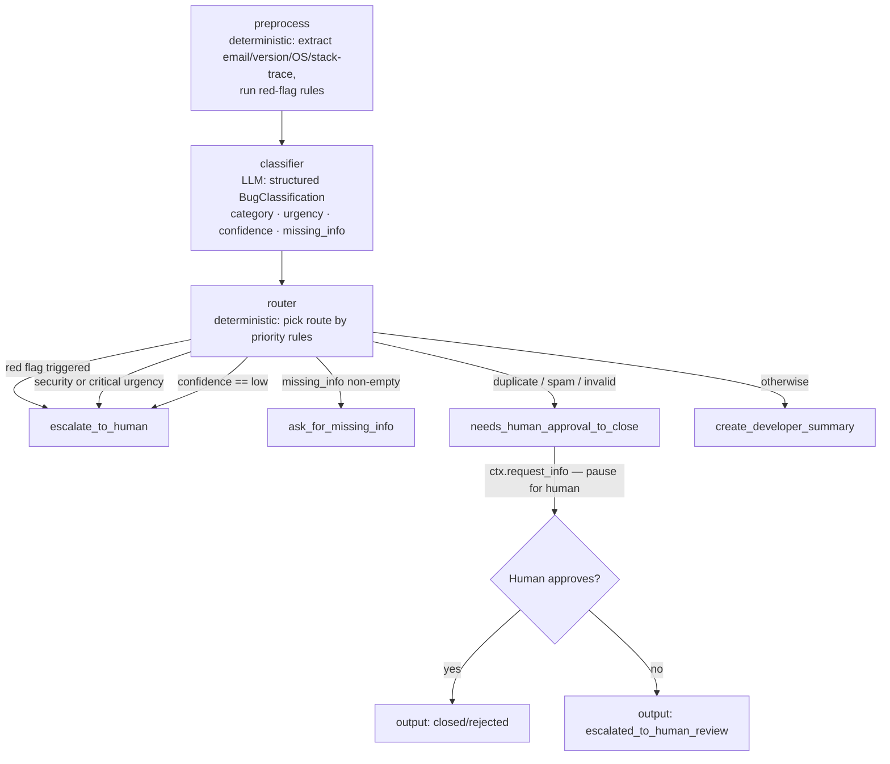

# Bug Report Triage Agent


An agentic workflow that triages incoming bug reports end-to-end: it preprocesses the raw text, classifies it with an LLM into a structured schema, applies deterministic override rules, and routes each report to the right action — all with a typed audit trail and a human-in-the-loop gate for risky decisions.

---

## Tech stack

| Layer | Technology |
|---|---|
| Workflow orchestration | [Microsoft Agent Framework](https://pypi.org/project/agent-framework-core/) 1.8.1 |
| LLM classification | OpenAI `gpt-4o-mini` via MAF structured output |
| Data validation | [Pydantic](https://docs.pydantic.dev/) v2 |
| Runtime | Python 3.10+ |
| Packaging | `pyproject.toml` src-layout, `pip install -e ".[dev]"` |
| Testing | pytest (offline; no API key needed) |
| Containers | Docker + Docker Compose |

---

## Architecture



### Design principles

- **Classifier proposes, router decides.** The LLM suggests a route on `BugClassification.route`; the deterministic `decide_route()` function in `router.py` is the final authority and can override it.
- **Explicit confidence signal.** The LLM must emit `confidence: "low" | "medium" | "high"`. A `"low"` signal routes the report to human review immediately — ambiguous reports are caught at the source rather than inferred from downstream signals.
- **Deterministic red-flag rules.** Four regex-based rules (RF001–RF004) in `red_flags.py` fire during preprocessing. If any trigger, the router escalates regardless of what the LLM says.
- **Human-in-the-loop for risky actions.** Closing or rejecting a report (duplicate/spam/invalid) requires explicit human approval via MAF's `request_info` / `response_handler` API.
- **LLM isolation.** Only `classifier_agent.py` talks to OpenAI. Every other module is deterministic and unit-testable offline.

---

## Quick start

### Option A — Docker (recommended, zero setup)

```bash
git clone https://github.com/danielchani/bug-triage-agent.git
cd bug-triage-agent
cp .env.example .env          # add your OPENAI_API_KEY if you want real LLM mode

# One-command demo (offline mock mode — no API key needed):
docker compose run -e BUG_TRIAGE_MOCK_LLM=true bug-triage samples/complete_bug.txt

# Real LLM mode (requires OPENAI_API_KEY in .env):
docker compose run bug-triage samples/critical_security.txt

# Batch mode:
docker compose run -e BUG_TRIAGE_MOCK_LLM=true bug-triage --batch samples/
```

### Option B — Local Python

```bash
git clone https://github.com/danielchani/bug-triage-agent.git
cd bug-triage-agent

python -m venv .venv
# Windows
.venv\Scripts\activate
# macOS / Linux
source .venv/bin/activate

pip install -e ".[dev]"

cp .env.example .env
# edit .env — add OPENAI_API_KEY or leave BUG_TRIAGE_MOCK_LLM=true for offline use
```

---

## Environment variables

Set these in `.env` (see `.env.example`). `.env` is gitignored and must never be committed.

| Variable | Default | Purpose |
|---|---|---|
| `OPENAI_API_KEY` | _(empty)_ | Required in real mode. |
| `OPENAI_CHAT_MODEL_ID` | `gpt-4o-mini` | Model used for classification. |
| `BUG_TRIAGE_MOCK_LLM` | `false` | `true` → deterministic keyword-based classifier; no network or API key needed. |
| `TRIAGE_AUDIT_LOG` | `triage_audit.jsonl` | Path for the JSONL audit log. |

---

## Running samples

```bash
# Escalates immediately (security keywords + RF004 red flag)
python -m bug_triage.main samples/critical_security.txt

# Asks for missing info (no version/OS/steps in the report)
python -m bug_triage.main samples/missing_info.txt

# Creates developer summary (complete, actionable report)
python -m bug_triage.main samples/complete_bug.txt

# Pauses for human approval before closing a duplicate
python -m bug_triage.main samples/invalid_needs_approval.txt --auto-approve
python -m bug_triage.main samples/invalid_needs_approval.txt --auto-reject
```

### Batch & stdin

```bash
# All .txt files in a folder
python -m bug_triage.main --batch samples/

# CSV with a "text" column (also accepts: body, description, report)
python -m bug_triage.main --csv samples/batch_sample.csv

# Read from stdin
echo "App crashes on startup, Windows 11 v2.3.1. Steps: open app." | python -m bug_triage.main -
```

---

## Sample output

```
[executor_started] preprocess
[executor_completed] preprocess
[executor_started] classifier
[executor_completed] classifier
[executor_started] router
[executor_completed] router
[route] -> create_developer_summary
[route] requires_human=False risky_action=False
[route] Looks like a complete, actionable bug report.
[executor_started] create_developer_summary
[output] create_developer_summary:
DEVELOPER TICKET SUMMARY
Category: bug | Urgency: medium | Sentiment: calm
Version: 4.12.1
OS: Windows
Stack trace included: yes
Reasoning: Complete report with version, OS, steps, and expected/actual behaviour.

Original report:
Export to CSV fails on rows with commas in the Notes field. ...
```

Full transcript including the human-approval flow: [`sample_run.txt`](sample_run.txt).

---

## Running tests

```bash
# All 96 tests — fully offline, no API key needed
pytest

# With verbose output
pytest -v

# Specific test module
pytest tests/test_red_flags.py -v
```

The test suite covers:
- Pydantic model validation (including invalid inputs)
- Deterministic preprocessing (email masking, version/OS/stack extraction)
- Red-flag pattern rules (all four rules, hit and miss cases)
- Router priority rules (all five rules including confidence and red-flag overrides)
- Mock classifier confidence levels (high / medium / low mapping)
- Audit log (build, append, multi-entry, field correctness)
- Batch input (CSV column aliases, empty rows, stdin path)
- End-to-end workflow (all four routes, human-approval gate)

---

## Routing rules

The router (`src/bug_triage/router.py`) picks exactly one route in priority order:

| Priority | Condition | Route | Human? | Risky? |
|---|---|---|---|---|
| 0 | `red_flags_triggered` non-empty | `escalate_to_human` | Yes | No |
| 1 | `category == "security"` or `urgency == "critical"` | `escalate_to_human` | Yes | No |
| 2 | `confidence == "low"` | `escalate_to_human` | Yes | No |
| 3 | `missing_info` non-empty | `ask_for_missing_info` | No | No |
| 4 | `category` in `{duplicate, spam, invalid}` | `needs_human_approval_to_close` | Yes | Yes |
| 5 | otherwise | `create_developer_summary` | No | No |

### Red-flag rules (RF001–RF004)

Triggered by regex match on sanitized text; override LLM output unconditionally.

| ID | Covers |
|---|---|
| RF001 | SQL injection, XSS, RCE, CSRF |
| RF002 | Data breach, GDPR, PII exposure |
| RF003 | Service outage, production down, all users affected |
| RF004 | Authentication bypass, privilege escalation, zero-day, account takeover |

---

## Audit log

Every triage run appends a JSONL line to `triage_audit.jsonl` (excluded from git). Each entry records:

```json
{
  "timestamp": "2026-06-25T14:30:00+00:00",
  "source": "samples/complete_bug.txt",
  "category": "bug",
  "urgency": "medium",
  "confidence": "high",
  "route": "create_developer_summary",
  "requires_human": false,
  "risky_action": false,
  "red_flags_triggered": [],
  "missing_info": [],
  "reasoning": "Complete bug report with all required fields.",
  "human_decision": null
}
```

To disable: `--no-audit`. To redirect: set `TRIAGE_AUDIT_LOG=/path/to/file.jsonl`.

---

## Project structure

```
bug-triage-agent/
├── Dockerfile
├── docker-compose.yml
├── pyproject.toml            # package metadata + dependencies (src-layout)
├── requirements.txt
├── .env.example
├── sample_run.txt            # full captured transcript
├── samples/
│   ├── critical_security.txt
│   ├── missing_info.txt
│   ├── complete_bug.txt
│   ├── invalid_needs_approval.txt
│   └── batch_sample.csv      # 3-row demo for --csv mode
├── src/bug_triage/
│   ├── models.py             # BugClassification, RouteDecision, ... (Pydantic)
│   ├── red_flags.py          # deterministic RF001–RF004 override rules
│   ├── preprocess.py         # PII masking, signal extraction, red-flag check
│   ├── classifier_agent.py   # LLM executor + offline mock
│   ├── router.py             # decide_route() — final routing authority
│   ├── actions.py            # 4 terminal executors incl. request_info gate
│   ├── audit_log.py          # JSONL decision audit log
│   ├── workflow.py           # MAF workflow graph assembly
│   └── main.py               # CLI: single file, stdin, --batch, --csv
└── tests/                    # 96 tests, all offline
```

---

## Quality gates

- **96 tests, all offline** — `pytest` needs no API key; mock classifier covers the same code paths as the real LLM.
- **Structured output enforced** — `response_format=BugClassification` on the OpenAI call; Pydantic validates every field including the new `confidence` enum.
- **Deterministic routing** — `decide_route()` is a pure function with 14 parametrized test cases.
- **Red-flag hard overrides** — 13 parametrized regex tests, each asserting hit or miss independently of the LLM.
- **Audit log integrity** — Every run writes a verifiable JSONL entry; tested for field correctness and multi-entry appends.
- **No secrets in repo** — `.env`, `triage_audit.jsonl`, and generated artifacts are gitignored.

---

## Known limitations

- **No persistence layer** — the audit log is a flat file; no database or search index.
- **No web interface** — CLI only; no REST endpoint to submit reports over HTTP.
- **Single-tenant** — no user/org model; all reports go into one workflow instance.
- **No LLM retry logic** — if the OpenAI call times out, the run fails with an exception.
- **Mock classifier is keyword-only** — it is not trained and will miss nuanced cases that the real LLM handles well.
- **Batch runs are sequential** — reports in `--batch` / `--csv` mode are processed one at a time.

---

## Future improvements

- **FastAPI endpoint** — accept reports over HTTP and return triage decisions as JSON responses.
- **SQLite audit store** — replace the JSONL file with a queryable local database.
- **Accuracy dashboard** — track classification distributions and human override rates over time.
- **Few-shot prompting** — inject recent human-corrected decisions into the system prompt as examples.
- **Parallel batch processing** — run `asyncio.gather` over multiple reports concurrently.
- **Webhook output** — post triage decisions to Slack, Linear, or Jira instead of printing to stdout.

---

## Security notes

- `.env` is in `.gitignore` — never committed.
- Secrets are passed only via environment variables; no hardcoded credentials anywhere in the codebase.
- PII (email addresses) is extracted and replaced with `[EMAIL]` in sanitized text before LLM processing.
- The `triage_audit.jsonl` log contains sanitized text only (emails already masked by the preprocess step).
