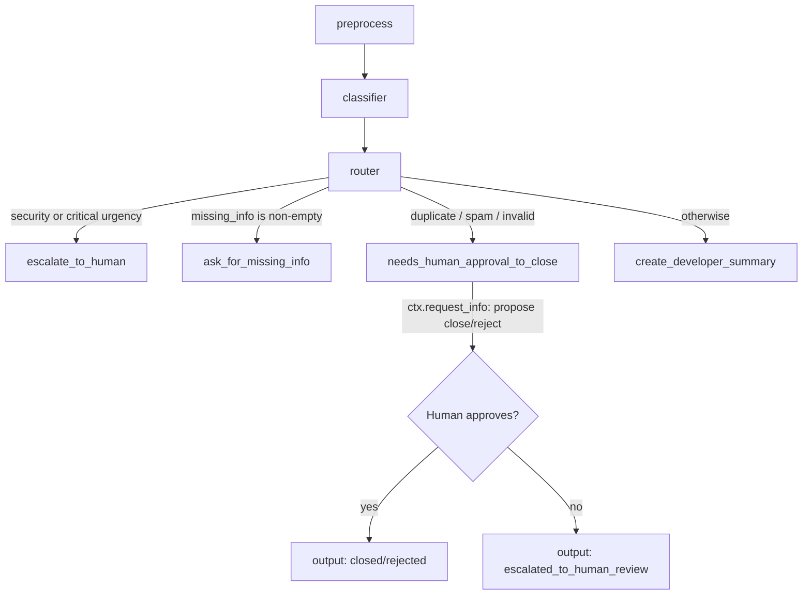

# Bug Report Triage Workflow Agent


A Microsoft Agent Framework (MAF) workflow that takes a raw bug report, runs
it through a deterministic preprocessing step, classifies it with an LLM
agent into a structured `BugClassification` (category, urgency, sentiment,
missing info, reasoning, and a proposed route), deterministically decides what
to do with it, and then either drafts a customer reply, summarizes it for
developers, escalates it to a human, or pauses for human approval before
closing it as a duplicate/spam/invalid report.

## Table of contents

- [Workflow graph](#workflow-graph)
- [Project structure](#project-structure)
- [Setup](#setup)
- [Environment variables](#environment-variables)
- [Running the samples](#running-the-samples)
- [Routes](#routes)
- [Sample output](#sample-output)
- [Notes on `.env`, mock mode, and the real LLM](#notes-on-env-mock-mode-and-the-real-llm)

## Workflow graph



## Project structure

```
bug-triage-maf-workflow/
├── README.md
├── pyproject.toml         # Package metadata + dependencies (src-layout)
├── requirements.txt
├── sample_run.txt         # Captured transcript incl. the request_info bonus flow
├── .env.example
├── samples/                       # Raw bug reports used by the CLI
│   ├── critical_security.txt      # -> escalate_to_human
│   ├── missing_info.txt           # -> ask_for_missing_info
│   ├── complete_bug.txt           # -> create_developer_summary
│   └── invalid_needs_approval.txt # -> needs_human_approval_to_close
├── src/bug_triage/
│   ├── models.py           # Pydantic models (BugReportInput, BugClassification, ...)
│   ├── preprocess.py        # Deterministic preprocessing executor
│   ├── classifier_agent.py # LLM classifier executor (+ offline mock mode)
│   ├── router.py            # Deterministic routing rules + router executor
│   ├── actions.py            # 4 terminal action executors (incl. request_info gate)
│   ├── workflow.py            # Builds the workflow graph
│   └── main.py                 # CLI entrypoint
└── tests/                  # Offline unit + workflow tests (pytest)
```

## Setup

```bash
git clone https://github.com/danielchani/bug-triage-maf-workflow.git
cd bug-triage-maf-workflow

python -m venv .venv
# Windows
.venv\Scripts\activate
# macOS / Linux
source .venv/bin/activate

pip install -e ".[dev]"

cp .env.example .env
# then edit .env (see Environment variables below)
```

## Environment variables

Set these in `.env` (see `.env.example`):

| Variable | Default | Purpose |
|---|---|---|
| `OPENAI_API_KEY` | _(empty)_ | OpenAI API key used by the classifier agent in real mode. Required unless `BUG_TRIAGE_MOCK_LLM=true`. |
| `OPENAI_CHAT_MODEL_ID` | `gpt-4o-mini` | Chat model used for classification. |
| `BUG_TRIAGE_MOCK_LLM` | `false` | Set to `true` to use a deterministic, keyword-based mock classifier instead of calling OpenAI - useful for offline development and tests. |

## Running the samples

Each sample is a raw bug report `.txt` file in `samples/`. Run one through the
workflow with:

```bash
python -m bug_triage.main samples/critical_security.txt
python -m bug_triage.main samples/missing_info.txt
python -m bug_triage.main samples/complete_bug.txt
python -m bug_triage.main samples/invalid_needs_approval.txt --auto-approve
```

The last sample triggers the bonus human-approval gate (see below), so it
pauses mid-run with a `[request_info]` event. Without `--auto-approve` /
`--auto-reject`, the CLI prompts interactively (`Approve this action? [y/n]:`);
the two flags make the run non-interactive (useful for scripting/demos).

## Routes

The router (`src/bug_triage/router.py`) inspects the classifier's
`BugClassification` and picks exactly one route, in this priority order:

1. **`escalate_to_human`** - `category == "security"` or `urgency == "critical"`.
   The report is printed as a human-escalation summary; no automated action is
   taken. Demonstrated by `samples/critical_security.txt`.
2. **`ask_for_missing_info`** - `missing_info` is non-empty. A draft customer
   reply is generated asking for the specific missing fields (e.g. version,
   OS, steps to reproduce). Demonstrated by `samples/missing_info.txt`.
3. **`needs_human_approval_to_close`** - category is `duplicate`, `spam`, or
   `invalid` (and nothing is missing). This is the **bonus** "risky action"
   gate: before closing/rejecting the report, the workflow calls
   `ctx.request_info(...)` to propose "Close this report as
   duplicate/spam/invalid", prints its reasoning, and waits for a human
   response.
   - If approved -> output reports the action taken: **closed/rejected**.
   - If rejected -> output reports **escalated_to_human_review** instead.
   Demonstrated by `samples/invalid_needs_approval.txt`.
4. **`create_developer_summary`** (default) - a complete, actionable bug
   report. A concise developer-facing ticket summary is generated. Demonstrated
   by `samples/complete_bug.txt`.

## Sample output

See [`sample_run.txt`](sample_run.txt) for a full captured transcript of:

```bash
python -m bug_triage.main samples/invalid_needs_approval.txt --auto-approve
```

It shows `preprocess`, `classifier`, and `router` completing, the chosen route
(`needs_human_approval_to_close`), the `[request_info]` pause for human
approval, and the final `closed/rejected` output - plus notes on what the
`--auto-reject` path produces instead.

## Notes on `.env`, mock mode, and the real LLM

- `.env` is gitignored and must never be committed; `.env.example` documents
  the variables with placeholder values only.
- `src/bug_triage/classifier_agent.py` is the only module that talks to an
  LLM. With `BUG_TRIAGE_MOCK_LLM=true`, `classifier_executor` instead calls a
  deterministic, keyword-based classifier (`_mock_classify`) - no network
  access or API key needed. This is what the test suite and the captured
  `sample_run.txt` use.
- To exercise the real agent, set `BUG_TRIAGE_MOCK_LLM=false` (or remove it)
  and provide a valid `OPENAI_API_KEY` in `.env`. The rest of the workflow
  (preprocess, router, actions) is unchanged either way, since both classifier
  paths return the same `BugClassification` type.
